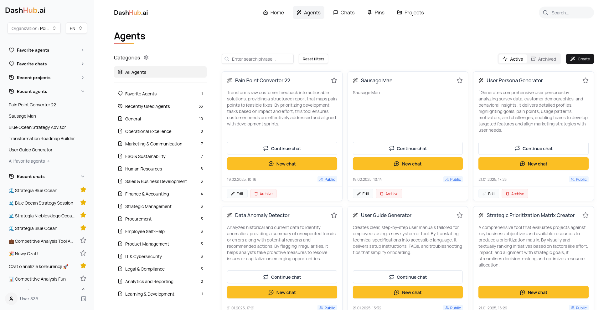

# 🚀 DashHub.ai: The Open-Source AI Platform for Teams of All Sizes



Empower your AI journey with **Seamless Integration** ⚙️, **Unmatched Flexibility** 🔄, and **Built-In Security** 🔐, all driven by a **Community-First Approach** 🌐

**DashHub.ai** is crafted to make AI more **accessible** 💰, **faster** to deploy ⏩, and **safer** 🔒 for businesses and teams of every size. From startups to growing organizations, DashHub.ai enables you to adopt the latest in AI technology while keeping full control over your data and APIs. The open-source design provides **tailored, plug-and-play solutions** that scale with your needs, **reducing complexity** and **lowering costs** 💡. DashHub.ai fosters **secure**, **vendor-neutral AI adoption**, letting teams **collaborate** 🤝 and **innovate** with ease 💻.

Whether you’re boosting team productivity or sparking creativity, DashHub.ai is the **smarter**, more **cost-effective** path to maximizing AI.

At DashHub.ai, we believe in tools that adapt to **your unique workflows and goals**, providing a seamless, flexible AI experience that helps you **work smarter** 🚀 while continuing to thrive with the tools you know.

## 📋 Table of Contents

- [🚀 DashHub.ai: The Open-Source AI Platform for Teams of All Sizes](#-dashhubai-the-open-source-ai-platform-for-teams-of-all-sizes)
  - [📋 Table of Contents](#-table-of-contents)
  - [🌟 Introduction](#-introduction)
  - [🌟 Why Choose DashHub.ai](#-why-choose-dashhubai)
  - [Setup ⚙️](#setup-️)
  - [Migrations ⚙️](#migrations-️)
  - [Elasticsearch](#elasticsearch)
  - [Deployment 🚀](#deployment-)
  - [👥 User Roles and Permissions](#-user-roles-and-permissions)
  - [🔑 Key Features](#-key-features)
    - [Projects 📂](#projects-)
    - [Agents 🧠](#agents-)
    - [Pins 📌](#pins-)
    - [Knowledge Management 📚](#knowledge-management-)
  - [📈 Future Plans - feel free to contribute! 🤘](#-future-plans---feel-free-to-contribute-)
  - [🔄 Integration Process](#-integration-process)

## 🌟 Introduction

Welcome to **DashHub.ai**, your ultimate solution for seamless AI integration. Our platform empowers users to effortlessly integrate, manage, and utilize **Large Language Models (LLMs)** and **Generative AI (GenAI)** solutions within any environment. We aim to simplify AI adoption, making it **accessible**, **safe**, **efficient**, and **cost-effective** for everyone.

## 🌟 Why Choose DashHub.ai

-   **Unified Interface for Leading AI Models**: Integration with OpenAI ChatGPT, Google Gemini, Anthropic Claude, Meta Llama, Deepseek, Perplexity, Hugging Face, and more.
-   **Cost-Effective**: Pay for usage, not per account. Gain access to the latest and most specialized models without multiple subscriptions.
-   **Custom AI Agents**: Create and manage AI-powered Agents tailored to specific functions, deployable across your entire organization.
-   **Fast and Easy Implementation**: Get up and running quickly with minimal setup, suitable for both individuals and enterprises.
-   **Project Collaboration**: Organize work into projects with shared knowledge bases and team collaboration features.
-   **Context Preservation**: Maintain conversation history and data consistency across different AI models.
-   **Secure Access Control**: Role-based permissions and authentication for enhanced security.
-   **Flexible Deployment**: Deploy DashHub.ai locally or in the cloud to suit your infrastructure.
-   **Enterprise Application Integration** Integration with Microsoft 365 and Google Workspace.
-   **Data Processing and Search Independend from AI Provider**

## Setup ⚙️

To run the project, follow these steps:

1.  Clone the repository by running the following command:

    ```
    git clone git@github.com:DashHub-ai/DashHub.git
    ```

2.  Install the required dependencies by running the following command:

    ```bash
    docker compose up --build
    ```

3.  Create base organization using [admin panel](http://localhost:5174).

4.  Add embedding and LLM model using [chat panel](http://localhost:5173).

The default credentials for the admin panel and chat application are:

-   **Email**: `root@dashhub.ai`
-   **Password**: `123456`

## Migrations ⚙️

To run the migrations, follow these steps:

 ```bash
 cd apps/backend
 npm run db:migrate
 ```

To rollback the migrations, follow these steps:

 ```bash
 cd apps/backend
 npm run db:migrate --down
 ```

## Elasticsearch

To reindex all the data in Elasticsearch, run the following command:

 ```bash
 npm run es:reindex:all
 ```

## Deployment 🚀

To deploy the project to the **staging** environment, run the following command:

```bash
git push origin main:hetzner/staging
```

To deploy the project to the **production** environment, use the following command:

```bash
git push origin main:hetzner/production
```

## 👥 User Roles and Permissions

The platform supports three types of users:

1.  **Admin**
    -   Add new users to the system
    -   Manage user permissions
2.  **Tech Users**
    -   Add and manage new Agents
    -   Manage LLM integrations
    -   Configure storage solutions
    -   Manage Applications
3.  **Users (Employees)**
    -   Interact with general chat interfaces
    -   Create and manage projects
    -   Invite team members to projects
    -   Utilize Agents within projects
    -   Use Applications for specific tasks

## 🔑 Key Features

### Projects 📂

-   **Dedicated Spaces**: Create projects with custom knowledge bases and settings.
-   **Collaboration**: Invite team members and work together in one space.
-   **History Preservation**: Maintain chat history and context within each project.

### Agents 🧠

-   **Custom AI Assistants**: Develop AI Agents specialized for specific tasks.
-   **Organization-Wide Access**: Manage and deploy Agents across your entire organization.
-   **Knowledge Integration**: Utilize project-specific information to enhance AI interactions.

### Pins 📌

-   **Pinning Important AI Outputs**: DashHub.ai's pinning feature allows users to bookmark significant AI-generated outputs. This functionality facilitates quick reference and collaboration, enabling teams to efficiently recall, access and utilize critical information within the platform.

### Knowledge Management 📚

-   **Knowledge Bases**: Users can add outputs to project knowledge bases.
-   **Export Options**: Download and export information as needed.
-   **Shared knowledge between all models**: No need to costly and slow fine tune models.

## 📈 Future Plans - feel free to contribute! 🤘

Planned enhancements for future versions include:

-   **Expanded Storage Options**
-   **Add more Enterprise Tool Integrations**
-   **Single Sign-On**
-   **Multi-Level Agent Creator**

## 🔄 Integration Process

Getting started with DashHub.ai is simple:

1.  **Sign Up**: Create an account.
2.  **Invite Users**: Add team members and assign roles.
3.  **Add LLM API Credentials**: (Simulated in MVP
