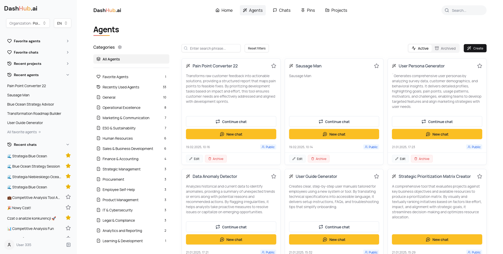

<div align="center">

# DashHub

**Self-hosted AI workspace for teams. Your data, your models, your rules.**

[](LICENSE)
[](https://github.com/DashHub-ai/DashHub)
[](docker-compose.quickstart.yml)
[](CONTRIBUTING.md)

[**Quick Start**](#quick-start) · [Features](#features) · [Architecture](#architecture) · [Contributing](#contributing)

</div>

---

DashHub is an open-source AI workspace that lets your entire team share access to GPT-4, Claude, Gemini, and local models through one private, self-hosted interface — without paying per seat or sending data to multiple vendors.



---

## Quick Start

**Prerequisites:** Docker + Docker Compose v2

```bash
# Clone and start everything in one shot
git clone --depth=1 https://github.com/DashHub-ai/DashHub && cd DashHub
docker compose -f docker-compose.quickstart.yml up -d --build
```

Or with the installer script:

```bash
curl -sSL https://raw.githubusercontent.com/DashHub-ai/DashHub/main/quick-start.sh | bash
```

Once running (first build ~3 min):

| Service | URL |
|---------|-----|
| Chat app | http://localhost:5173 |
| Admin panel | http://localhost:5174 |
| API | http://localhost:3000 |

**Default credentials:** `root@dashhub.ai` / `dashhub123`

> **Next step:** Open the admin panel, create an organization, then add an AI model (OpenAI key, Ollama, or any OpenAI-compatible API).

---

## Features

### 🤖 Multi-model, one interface
Connect OpenAI, Anthropic Claude, Google Gemini, DeepSeek, and any OpenAI-compatible endpoint — including **local models via Ollama** for zero-cost, fully private inference.

### 🔧 MCP tool servers
Plug any [Model Context Protocol](https://modelcontextprotocol.io/) server into your workspace. Your AI gets access to databases, APIs, file systems, and custom tools — all through a single config.

### 📂 Projects + knowledge bases
Organize work into projects with shared file uploads and vector-search knowledge. Every team member working in the same project has the same context.

### 🤖 Custom agents
Build agents with custom system prompts, a pinned AI model, and scoped knowledge. Share them across the organization or keep them private.

### ⌨️ Command palette
Press `Cmd+K` (or `Ctrl+K`) to instantly jump anywhere — chats, projects, agents — or search across all your content without leaving the keyboard.

### 📌 Pins
Bookmark important AI responses and share them with your team. Pins persist across model switches and chat sessions.

### 🔒 Role-based access
Three roles out of the box: **Admin** (user management), **Tech** (model & integration config), **User** (chat, projects, agents). Per-project permissions on top.

### 🔍 Full-text + vector search
Elasticsearch powers both keyword search and semantic (embedding-based) retrieval across all chats, projects, and knowledge bases.

### 🗂️ S3-compatible file storage
MinIO ships in the default stack. Drop in AWS S3, Cloudflare R2, or any S3-compatible bucket by changing three env vars.

---

## Architecture

```
┌──────────────────────────────────────────────┐
│  Browser                                      │
│  ┌─────────────────┐  ┌──────────────────┐   │
│  │  Chat app :5173  │  │  Admin UI :5174  │   │
│  └────────┬─────────┘  └────────┬─────────┘   │
└───────────┼──────────────────────┼─────────────┘
            │                      │
            ▼                      ▼
    ┌───────────────────────────────────┐
    │  Hono API server  :3000           │
    │  (TypeScript, tsyringe DI)        │
    └────┬──────────┬──────────┬────────┘
         │          │          │
         ▼          ▼          ▼
    Postgres    Elasticsearch  MinIO
    + pgvector  (search)       (files)
```

**Stack:** TypeScript monorepo · Hono (backend) · React + Vite (frontend) · Kysely ORM · fp-ts · Zod · Tailwind CSS

---

## Configuration

All configuration is passed as environment variables. Copy the quickstart defaults or see `apps/backend/.env.example`.

| Variable | Description | Default |
|----------|-------------|---------|
| `USER_ROOT_EMAIL` | Root admin email | `root@dashhub.ai` |
| `USER_ROOT_PASSWORD` | Root admin password | `dashhub123` |
| `JWT_SECRET` | Auth token signing key — **change in production** | — |
| `APP_ENDUSER_DOMAIN` | Domain for user access (used in emails) | `localhost` |
| `DATABASE_*` | PostgreSQL connection | see compose file |
| `ELASTICSEARCH_*` | Elasticsearch connection | see compose file |
| `MINIO_*` | S3-compatible storage | see compose file |

---

## Development setup

```bash
git clone https://github.com/DashHub-ai/DashHub && cd DashHub
docker compose up --build   # starts all services in dev/watch mode
```

The dev setup hot-reloads the backend on TypeScript changes and runs Vite dev servers for both frontends.

```bash
# Run DB migrations manually
cd apps/backend && npm run db:migrate

# Re-index all content in Elasticsearch
cd apps/backend && npm run es:reindex:all
```

---

## Contributing

Issues and PRs are welcome. A few things that would make a big difference:

- **Frontend for eval runner** — backend + SDK are merged, needs a UI
- **MCP server directory** — curated list of useful MCP servers for teams
- **Docker image publishing** — GitHub Actions workflow to push to ghcr.io
- **SSO / SAML** — enterprise identity provider support
- **More AI providers** — Cohere, Mistral API, Bedrock

See [open issues](https://github.com/DashHub-ai/DashHub/issues) and [CONTRIBUTING.md](CONTRIBUTING.md) to get started.

---

## User roles

| Role | Can do |
|------|--------|
| **Admin** | Manage users, assign roles, view audit logs |
| **Tech** | Add AI models, configure MCP servers, manage S3 buckets, build agents |
| **User** | Chat, create projects, use agents, upload files, pin responses |

---

## Roadmap

- [x] Multi-model support (OpenAI, Gemini, DeepSeek, Ollama)
- [x] MCP tool server integration
- [x] Command palette (Cmd+K)
- [x] Projects + vector knowledge bases
- [x] External API integrations
- [ ] Eval / benchmark runner
- [ ] SSO / SAML
- [ ] Published Docker images (no-clone install)
- [ ] Audit log UI
- [ ] Plugin marketplace

---

## License

MIT © [DashHub.ai](https://dashhub.ai)
